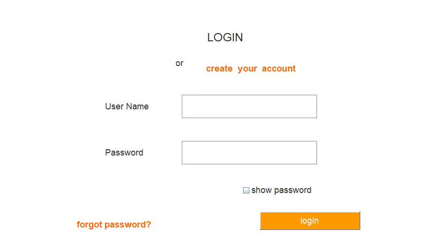

# FoodHome

<div align="center">
  <h1>🍽️ FoodHome</h1>
  <h3> Windows-Based Food Ordering Platform</h3>
  <p>
    Built with <strong>Java Swing</strong>, <strong>Apache Derby</strong>, and <strong>JFreeChart</strong>
  </p>
  
  
  
</div>

---

## 📌 Overview

**FoodHome** is a **Windows-based food ordering system** designed to connect cloud kitchen sellers with customers. It features role-based access, allowing **sellers** to manage inventory and view analytics, while **customers** can browse menus, place orders, and receive timestamped bills.

---

## 🎯 Key Features

- 👥 **Role-Based Access**: Separate login and dashboard interfaces for customers and sellers.
- 🧾 **Automated Billing**: Generates timestamped receipts upon order completion.
- 📦 **Inventory & Order Management**: Sellers can manage food items and order processing.
- 📊 **Monthly Order Analytics**: Uses **JFreeChart** for seller-side data visualization.
- 🧑‍💻 **Profile Management**: Allows users to securely update personal information.
- 🖼️ **Menu **: Customers can order their favourite food.

---

## 🛠️ Tech Stack

| Layer         | Technology               |
|---------------|---------------------------|
| UI            | Java Swing (JFrame)       |
| Backend       | Java                      |
| Database      | Apache Derby              |
| Visualization | JFreeChart                |

---


## 📸 Screenshots
### 🏠 Login Page  

### 🏠 Home Page  


### 🛍️ Service Selection  


### 🛍️ Cart 


### 📋 Add Adresses


### 📋 About Us


### 🛠️ Admin Dashboard  


### 🛠️ Service List


### 📋 Customer Order History  


---

## 🚀 How to Run

1. **Clone the repository**
   ```bash
   git clone https://github.com/Shubha274/FoodHome.git
